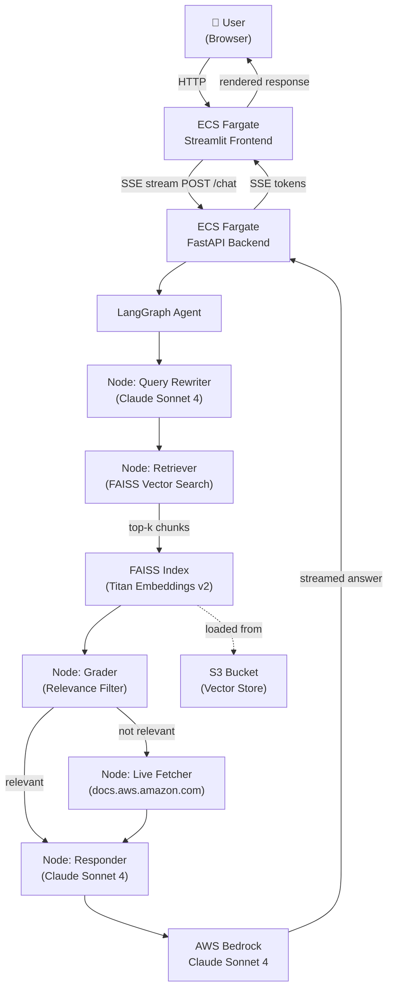

# ☁️ AWS Docs Agent

An agentic RAG chatbot that lets you interact with AWS documentation through natural language.
Built with LangGraph, AWS Bedrock, FAISS, FastAPI, and Streamlit. Infrastructure managed with AWS CDK.

**🌐 Live Demo**: http://AwsDoc-Front-64taqPQwggj1-350025795.us-east-1.elb.amazonaws.com

---

## Architecture Overview



---

## Tech Stack

| Layer | Technology |
|-------|-----------|
| LLM | Claude Sonnet 4 via AWS Bedrock |
| Embeddings | Amazon Titan Embeddings v2 via Bedrock |
| Orchestration | LangGraph (agentic loop) |
| Vector Store | FAISS (loaded from S3 at startup) |
| Backend | FastAPI + SSE streaming |
| Frontend | Streamlit |
| IaC | AWS CDK (Python) |
| Compute | ECS Fargate (backend 2vCPU/8GB, frontend 0.5vCPU/1GB) |
| Networking | VPC + ALB (public) |
| Storage | S3 (vector index) |
| CI/CD | AWS CodeBuild → ECR |

---

## Project Structure

```
aws-docs-agent/
├── backend/
│   ├── app/
│   │   ├── main.py              # FastAPI entrypoint + S3 index download
│   │   ├── config.py            # Pydantic settings
│   │   ├── prompts.py           # All LLM prompt templates
│   │   ├── session.py           # In-memory session store
│   │   ├── api/
│   │   │   └── routes.py        # /chat, /health, /history endpoints
│   │   ├── agent/
│   │   │   ├── graph.py         # LangGraph StateGraph definition
│   │   │   ├── nodes.py         # Node functions
│   │   │   ├── tools.py         # LangChain tools
│   │   │   └── state.py         # AgentState TypedDict
│   │   └── rag/
│   │       ├── ingestor.py      # Scrape → chunk → embed → save
│   │       ├── retriever.py     # FAISS BaseRetriever wrapper
│   │       └── embeddings.py    # Titan Embeddings client
│   ├── scripts/
│   │   └── ingest_docs.py       # CLI ingestion runner
│   └── Dockerfile
├── frontend/
│   ├── app.py                   # Streamlit chat UI
│   └── Dockerfile
├── infra/                       # AWS CDK (Python)
│   ├── app.py                   # CDK app entrypoint
│   └── stacks/
│       ├── storage_stack.py     # S3 bucket
│       ├── compute_stack.py     # VPC + ECS Fargate + ALB (backend)
│       ├── frontend_stack.py    # ECS Fargate + ALB (frontend)
│       ├── pipeline_stack.py    # CodeBuild + ECR
│       └── network_stack.py     # Reserved for shared networking
├── tests/
│   ├── unit/
│   └── integration/
├── docs/
│   └── architecture.md
├── apprunner.yaml
├── docker-compose.yml
├── Makefile
└── .env.example
```

---

## Prerequisites

| Requirement | Version | Notes |
|------------|---------|-------|
| Python | 3.11+ | |
| AWS CLI | v2 | Configured with credentials |
| AWS CDK CLI | 2.x | `npm install -g aws-cdk` |
| Node.js | 18+ | CDK dependency |
| AWS Account | — | Bedrock model access required |

### Enable Bedrock Model Access

1. Go to **AWS Console → Bedrock → Model Catalog**
2. Models are auto-enabled on first invoke in your account
3. Verify access:

```powershell
aws bedrock list-foundation-models --region us-east-1 --query "modelSummaries[?contains(modelId, 'claude')].[modelId]" --output table
```

---

## Local Setup

### 1. Clone the repo

```bash
git clone https://github.com/Ashishmangal06/aws-docs-agent.git
cd aws-docs-agent
```

### 2. Create virtual environment

```bash
python -m venv aws-docs-env
# Windows
aws-docs-env\Scripts\activate
# Mac/Linux
source aws-docs-env/bin/activate
```

### 3. Configure environment

```bash
cp .env.example .env
```

Edit `.env`:
```env
AWS_REGION=us-east-1
BEDROCK_MODEL_ID=us.anthropic.claude-sonnet-4-20250514-v1:0
BEDROCK_EMBEDDINGS_MODEL_ID=amazon.titan-embed-text-v2:0
VECTOR_STORE_PATH=./data/faiss_index
TOP_K_RESULTS=5
LOG_LEVEL=INFO
CORS_ORIGINS=["http://localhost:8501"]
BACKEND_URL=http://localhost:8000
```

### 4. Install backend dependencies

```bash
pip install -r backend/requirements.txt
```

### 5. Run ingestion (one-time)

```bash
python backend/scripts/ingest_docs.py
```

Takes ~15-20 minutes for 5 services × 30 pages.

### 6. Run backend locally

```bash
uvicorn backend.app.main:app --reload --port 8000
```

### 7. Run frontend locally

```bash
pip install -r frontend/requirements.txt
streamlit run frontend/app.py
```

Open: **http://localhost:8501**

---

## AWS Deployment

### 1. Bootstrap CDK

```bash
export AWS_ACCOUNT_ID=$(aws sts get-caller-identity --query Account --output text)
cdk bootstrap aws://$AWS_ACCOUNT_ID/us-east-1
```

### 2. Deploy storage stack

```bash
cd infra
cdk deploy AwsDocsAgentStorageStack
```

### 3. Run ingestion and upload to S3

```bash
python backend/scripts/ingest_docs.py
aws s3 sync data/faiss_index/ s3://aws-docs-agent-vector-store-$AWS_ACCOUNT_ID-us-east-1/faiss_index/
```

### 4. Deploy pipeline stack (CodeBuild + ECR)

```bash
cdk deploy AwsDocsAgentPipelineStack
```

### 5. Build Docker images

```bash
aws codebuild start-build --project-name aws-docs-agent-build --region us-east-1
aws codebuild start-build --project-name aws-docs-agent-frontend-build --region us-east-1
```

### 6. Deploy backend and frontend

```bash
cdk deploy AwsDocsAgentComputeStack
cdk deploy AwsDocsAgentFrontendStack
```

### 7. Get URLs

```bash
aws cloudformation describe-stacks --stack-name AwsDocsAgentComputeStack \
  --query "Stacks[0].Outputs[?OutputKey=='BackendURL'].OutputValue" --output text

aws cloudformation describe-stacks --stack-name AwsDocsAgentFrontendStack \
  --query "Stacks[0].Outputs[?OutputKey=='FrontendURL'].OutputValue" --output text
```

### 8. Tear down

```bash
cdk destroy --all
```

---

## Sample Queries

```
"What are the S3 bucket limits and quotas?"
"How does Lambda cold start work and how can I reduce it?"
"Compare SQS Standard vs FIFO queues"
"What IAM policy conditions can I use for S3 access control?"
"How do I set up VPC peering between two AWS accounts?"
"What is the difference between ECS Fargate and EC2 launch type?"
"How does DynamoDB handle partition key hot spots?"
```

---

## Makefile Reference

| Command | Description |
|---------|-------------|
| `make ingest` | Run AWS docs ingestion pipeline |
| `make dev` | Start full stack with Docker Compose |
| `make synth` | Synthesize CDK CloudFormation templates |
| `make deploy` | Deploy all CDK stacks to AWS |
| `make destroy` | Tear down all AWS resources |
| `make test` | Run all tests |

---

## Running Tests

```bash
# Unit tests only
pytest tests/unit/ -v

# All tests (requires backend running)
pytest tests/ -v
```