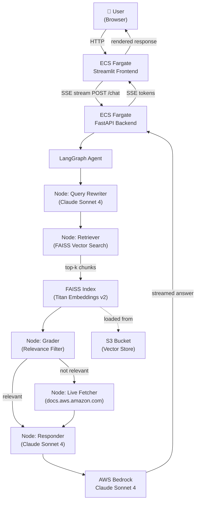

# ☁️ AWS Docs Agent

An agentic RAG chatbot that lets you interact with AWS documentation through natural language. Built with LangGraph, AWS Bedrock, FAISS, FastAPI, and Streamlit. Infrastructure fully managed with AWS CDK.

**🌐 Live Demo**: http://AwsDoc-Front-64taqPQwggj1-350025795.us-east-1.elb.amazonaws.com

---

## Architecture Overview



---

## How It Works

The agent uses a **5-node LangGraph pipeline** for every query:

1. **Query Rewriter** — Claude rewrites vague queries into precise AWS search terms
2. **Retriever** — FAISS similarity search returns top-5 relevant chunks
3. **Grader** — Claude grades each chunk for relevance, filtering noise before the LLM sees it
4. **Live Fetcher** — If grader rejects all chunks, fetches directly from `docs.aws.amazon.com`
5. **Responder** — Claude synthesizes a grounded answer with citations

This agentic routing prevents hallucination and ensures answers are always sourced from real AWS documentation.

---

## Tech Stack

| Layer | Technology |
|-------|-----------|
| LLM | Claude Sonnet 4 via AWS Bedrock |
| Embeddings | Amazon Titan Embeddings v2 via Bedrock |
| Orchestration | LangGraph (agentic loop) |
| Vector Store | FAISS (loaded from S3 at container startup) |
| Backend | FastAPI + Server-Sent Events streaming |
| Frontend | Streamlit |
| IaC | AWS CDK (Python) — 4 stacks |
| Compute | ECS Fargate (backend 2vCPU/8GB, frontend 0.5vCPU/1GB) |
| Networking | VPC + ALB (public) |
| Storage | S3 (FAISS vector index) |
| CI/CD | AWS CodeBuild → ECR → ECS |

---

## Project Structure

```
aws-docs-agent/
├── backend/
│   ├── app/
│   │   ├── main.py              # FastAPI entrypoint + S3 index download on startup
│   │   ├── config.py            # Pydantic settings (env-driven)
│   │   ├── prompts.py           # All LLM prompt templates
│   │   ├── session.py           # In-memory session store (Redis-ready interface)
│   │   ├── api/
│   │   │   └── routes.py        # /chat (SSE), /health, /history endpoints
│   │   ├── agent/
│   │   │   ├── graph.py         # LangGraph StateGraph — 5-node agentic pipeline
│   │   │   ├── nodes.py         # Node functions (rewriter, retriever, grader, responder)
│   │   │   ├── tools.py         # LangChain tools (live fetch, query rewrite)
│   │   │   └── state.py         # AgentState TypedDict
│   │   └── rag/
│   │       ├── ingestor.py      # Scrape → chunk → embed → FAISS index
│   │       ├── retriever.py     # FAISS BaseRetriever wrapper
│   │       └── embeddings.py    # Titan Embeddings v2 client
│   ├── scripts/
│   │   └── ingest_docs.py       # One-time CLI ingestion runner
│   └── Dockerfile
├── frontend/
│   ├── app.py                   # Streamlit chat UI with SSE streaming
│   └── Dockerfile
├── infra/                       # AWS CDK (Python)
│   ├── app.py                   # CDK app — wires 4 stacks together
│   └── stacks/
│       ├── storage_stack.py     # S3 bucket for FAISS index
│       ├── pipeline_stack.py    # CodeBuild projects + ECR repositories
│       ├── compute_stack.py     # VPC + ECS Fargate + ALB (backend)
│       ├── frontend_stack.py    # ECS Fargate + ALB (frontend)
│       └── network_stack.py     # Reserved for shared networking
├── tests/
│   ├── unit/
│   │   ├── test_nodes.py        # Agent node unit tests (8 tests, all mocked)
│   │   └── test_session.py      # Session store unit tests
│   └── integration/
│       └── test_api.py          # End-to-end API tests against live backend
├── docs/
│   └── architecture.md          # Deep-dive design decisions
├── docker-compose.yml           # Local development
├── Makefile                     # One-command operations
└── .env.example                 # Environment variable template
```

---

## AWS Infrastructure (CDK Stacks)

```
AwsDocsAgentStorageStack   → S3 bucket (FAISS index, versioned, encrypted)
AwsDocsAgentPipelineStack  → CodeBuild (backend + frontend) + ECR repositories
AwsDocsAgentComputeStack   → VPC + ECS Fargate backend + ALB + IAM task role
AwsDocsAgentFrontendStack  → ECS Fargate frontend + ALB
```

All resources tagged `Project=aws-docs-agent`. IAM task role follows least-privilege — Bedrock, S3, and SSM permissions scoped to specific resources only.

---

## Prerequisites

| Requirement | Version | Notes |
|------------|---------|-------|
| Python | 3.11+ | |
| AWS CLI | v2 | Configured with credentials |
| AWS CDK CLI | 2.x | `npm install -g aws-cdk` |
| Node.js | 18+ | Required by CDK |
| AWS Account | — | Bedrock access in us-east-1 |

### Verify Bedrock Access

```bash
aws bedrock-runtime invoke-model \
  --model-id "us.anthropic.claude-sonnet-4-20250514-v1:0" \
  --body fileb://request.json \
  --region us-east-1 output.json
```

---

## Local Setup

### 1. Clone and set up environment

```bash
git clone https://github.com/Ashishmangal06/aws-docs-agent.git
cd aws-docs-agent

python -m venv aws-docs-env
# Windows
aws-docs-env\Scripts\activate
# Mac/Linux
source aws-docs-env/bin/activate

pip install -r backend/requirements.txt
```

### 2. Configure environment

```bash
cp .env.example .env
```

Edit `.env`:

```env
AWS_REGION=us-east-1
BEDROCK_MODEL_ID=us.anthropic.claude-sonnet-4-20250514-v1:0
BEDROCK_EMBEDDINGS_MODEL_ID=amazon.titan-embed-text-v2:0
VECTOR_STORE_PATH=./data/faiss_index
TOP_K_RESULTS=5
CHUNK_SIZE=1000
CHUNK_OVERLAP=200
LOG_LEVEL=INFO
CORS_ORIGINS=["http://localhost:8501"]
BACKEND_URL=http://localhost:8000
```

### 3. Run ingestion (one-time, ~25-30 mins)

Scrapes 10 AWS services, embeds with Titan, builds FAISS index:

```bash
python backend/scripts/ingest_docs.py
```

### 4. Start the full stack

```bash
# Terminal 1 — backend
uvicorn backend.app.main:app --reload --port 8000

# Terminal 2 — frontend
pip install -r frontend/requirements.txt
streamlit run frontend/app.py
```

Open **http://localhost:8501**

---

## AWS Deployment

### 1. Bootstrap CDK

```bash
# Windows PowerShell
$ACCOUNT_ID = aws sts get-caller-identity --query Account --output text
cdk bootstrap aws://$ACCOUNT_ID/us-east-1
```

### 2. Deploy stacks in order

```bash
cd infra

# Storage first
cdk deploy AwsDocsAgentStorageStack

# Run ingestion locally, then upload index
python backend/scripts/ingest_docs.py
aws s3 sync data/faiss_index/ s3://aws-docs-agent-vector-store-$ACCOUNT_ID-us-east-1/faiss_index/

# Pipeline (CodeBuild + ECR)
cdk deploy AwsDocsAgentPipelineStack

# Build Docker images
aws codebuild start-build --project-name aws-docs-agent-build --region us-east-1
aws codebuild start-build --project-name aws-docs-agent-frontend-build --region us-east-1

# Deploy compute and frontend
cdk deploy AwsDocsAgentComputeStack
cdk deploy AwsDocsAgentFrontendStack
```

### 3. Get deployed URLs

```bash
# Backend URL
aws cloudformation describe-stacks \
  --stack-name AwsDocsAgentComputeStack \
  --query "Stacks[0].Outputs[?OutputKey=='BackendURL'].OutputValue" \
  --output text

# Frontend URL
aws cloudformation describe-stacks \
  --stack-name AwsDocsAgentFrontendStack \
  --query "Stacks[0].Outputs[?OutputKey=='FrontendURL'].OutputValue" \
  --output text
```

### 4. Tear down

```bash
cdk destroy --all
```

---

## Sample Queries

```
"What are the S3 bucket limits and quotas?"
"How does Lambda cold start work and how can I reduce it?"
"Compare SQS Standard vs FIFO queues"
"What IAM policy conditions can I use for S3 access control?"
"How do I set up VPC peering between two AWS accounts?"
"What is the difference between ECS Fargate and EC2 launch type?"
"How does DynamoDB handle partition key hot spots?"
"What are the RDS PostgreSQL instance size limits?"
```

---

## Running Tests

```bash
# Unit tests (no AWS required, all mocked)
pytest tests/unit/test_nodes.py tests/unit/test_session.py -v

# Integration tests (requires deployed backend)
# Windows
$env:BACKEND_URL = "http://your-alb-url"
pytest tests/integration/ -v
```

Current unit test results:
```
tests/unit/test_nodes.py::TestQueryRewriterNode::test_rewrites_vague_query PASSED
tests/unit/test_nodes.py::TestQueryRewriterNode::test_skips_rewrite_for_short_query PASSED
tests/unit/test_nodes.py::TestQueryRewriterNode::test_increments_iterations PASSED
tests/unit/test_nodes.py::TestGraderNode::test_marks_relevant_doc PASSED
tests/unit/test_nodes.py::TestGraderNode::test_irrelevant_doc_triggers_live_fetch PASSED
tests/unit/test_nodes.py::TestGraderNode::test_fails_open_on_json_error PASSED
tests/unit/test_nodes.py::TestResponderNode::test_produces_answer_and_citations PASSED
tests/unit/test_nodes.py::TestResponderNode::test_deduplicates_citations PASSED
8 passed in 1.31s
```

---

## Makefile Reference

| Command | Description |
|---------|-------------|
| `make ingest` | Run AWS docs ingestion pipeline |
| `make dev` | Start full stack with Docker Compose |
| `make synth` | Synthesize CDK CloudFormation templates |
| `make deploy` | Deploy all CDK stacks to AWS |
| `make destroy` | Tear down all AWS resources |
| `make diff` | Show CDK diff against deployed stacks |
| `make test` | Run all unit tests |
| `make lint` | Run ruff linter |

---

## Design Decisions

See [docs/architecture.md](docs/architecture.md) for the full deep-dive covering:

- Why LangGraph over a simple chain
- RAG chunking strategy and metadata design
- Grader node and hallucination prevention
- FAISS → OpenSearch upgrade path
- Why ECS Fargate over Lambda
- IAM least-privilege design
- Session memory and Redis upgrade path
- Known trade-offs and production improvements

---

## License

MIT